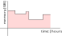

# MCC (*memory cloud chamber*)
This little program was written to investigate bit flips in main computer memory (RAM). These are events that change the state of one bit of memory - caused either by cosmic rays, hardware defects or god knows what else.

In high availability settings like servers, there is [ECC memory](https://en.wikipedia.org/wiki/ECC_memory) to protect against this. But most computer systems don't have these. So the question is: **How often will bit flips happen in non-ECC memory?**

## Methodology
*MCC* allocates a part of the RAM and fills it with zeros. Then it periodically checks if any of the bits have flipped. It changes the amount of allocated memory dynamically to impact the machine as little as possible. The error checks are surprisingly costly with large memory but everything is written explicitly single-threaded so the CPU impact will be limited as well.

To make any kind of analytics feasible, the integral of allocated memory over time is recorded and written to disk together with the timestamp of any possible events. The complete state of the program is persisted in a json file and read at startup to continue earlier sessions.

## MMC usage
The MSVC solution with all sources is in this repo. It compiles to a single binary file. The program allocates all free memory besides a reserve. That reserve is 3 (GB) by default and can be changed with the optional command line parameter: `-- reserve 2`. The allocated memory is constantly resized to be close to the desired reserve. The current state as well as any potential events are written to a `mcc_state_<PCNAME>.json` as well as the command line.

The memory usage informations as well as the retrieval of the PC name are using Windows headers, therefore the program is limited to Windows systems.

## Results
**So far (October 2019) there have been no bit flips recorded** over a volume of over 3000 GB-hours on two local machines.

## Literature and discussion
The academic literature on these effects is sparse. There is a 2009 paper from Google [[1]] sometimes referred to as the 'toronto paper'. Google looked only at ECC memory, but it can be used as a rough estimate. That paper postulates an error rate of "*25,000 to 70,000 errors per billion device hours per Mbit*". That is equivalent to 0.20 to 0.57 errors per GB-hour. That seems extremely high and would result in over 6 errors per hour on a 32GB system.

That number from the paper is mostly meaningless though as most machines did not experience any errors at all - they were concentrated on a small subset of machines. This naturally leads to the conclusion that these defects are usually not from external effects like cosmic rays, but much more likely to be caused by hardware effects. The rate as an average over all machines aren't a good target for comparison as a result.

Besides the origin of these events, they seem to be exceedingly rare. Rare enough for me to not have detected *any*.

[1]: https://ai.google/research/pubs/pub35162
[2]: http://lambda-diode.com/opinion/ecc-memory-2

## Terminology
When I say 'GB' I really mean GiG or 'Gibibytes' as in 1024^3 bytes. But that looks silly, sounds even sillier and no one uses it. So I'm being deliberately ignorant about that particular term.

This program was named *MCC* as an abbreviation for 'memory cloud chamber'. Cloud chambers are devices used to detect radiation. The term was coined at a time where I believed these bit flips originated from cosmic radiation, which they apparently don't.
